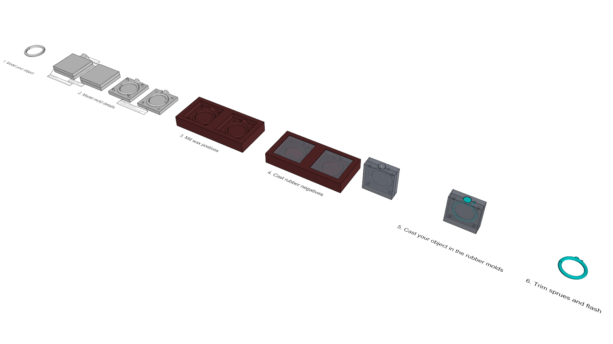

# Examples

An overview of different Fabrication tecniques available at Fellesverkstedet. For self study and reference.

## CNC Milling

CNC milling offer an enourmous amount of possibilites. This grid shows vious techniques combining differnt [milling bit](https://en.wikipedia.org/wiki/Milling_cutter) geometry with different [toolpath](https://en.wikipedia.org/wiki/Numerical_control) strategies:

### Molding and casting

Mold making makes it possible to cast objects from a huge amount of materials. The folder includes and example of CNC milling a two-sided mold.

